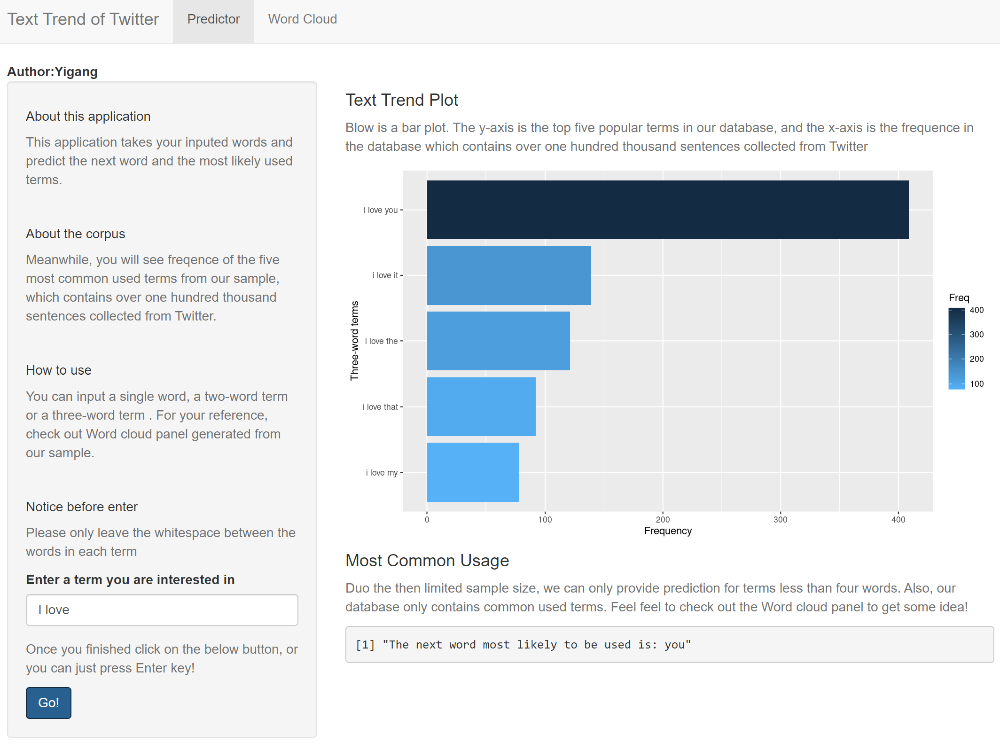

Data Science Capstone: Natural Language Processing with R
========================================================
author: Yigang
date: April 04, 2021
autosize: true

Introduction
========================================================
### Background
Around the world, people are spending an increasing amount of time on their mobile devices for email, social networking, banking and a whole range of other activities. But typing on mobile devices can be a serious pain.

### Source
Twitter is one of the most popular social network. So we collect over one hundred thousand sentences from twitter as our database. 

### Goal of This Application
The point of this Shinyapp is for users to have an ideal of the next word most likely to be used by their entered word or term. 

Algorithm and Usage
========================================================
## N-gram tokenizer 
- An n-gram model is a type of probabilistic language model for predicting the next item in such a sequence in the form of a (n − 1)–order Markov model.
- Two benefits of n-gram models (and algorithms that use them) are simplicity and scalability – with larger n, a model can store more context with a well-understood space–time tradeoff, enabling small experiments to scale up efficiently.
- Wiki: https://en.wikipedia.org/wiki/N-gram#n-gram_models

## Output
- User can enter a single word, a two-word term or a three-word term.
- A bar plot will be shown to display the trend of the term usage.
- User will get a prediction for the next word most likely to be used.

APP Interface
========================================================

Thank You
========================================================

Shinyapp: 
https://nocturnes92.shinyapps.io/WordsPrediction/

Github: 
https://github.com/nocturnes92/Data-Products

